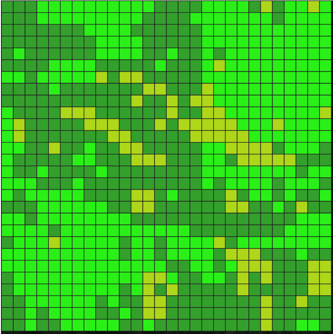
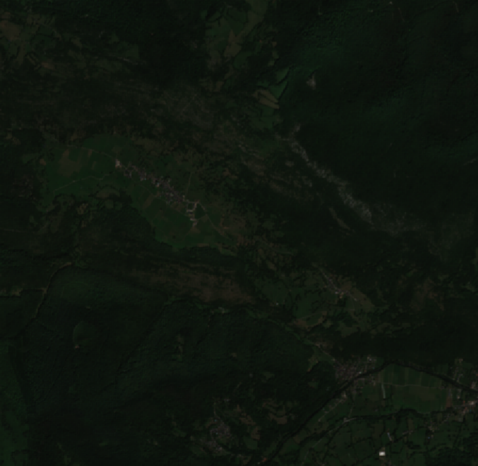
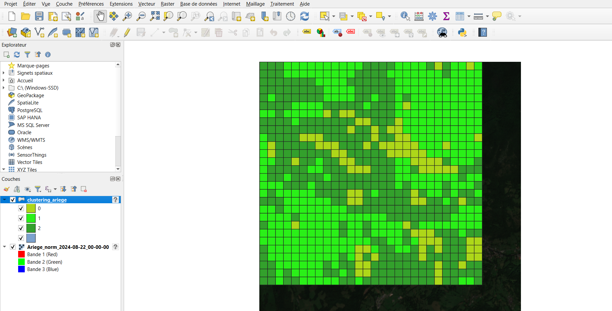

# SAT_DINOV2


We have used a pretrained Self Supervised Learning model, based on DINOV2, which performs to work on aerial images and particulary "for High resolution Canopy Height Prediction inference" (https://github.com/facebookresearch/HighResCanopyHeight). We will use it to extract features of aerial images(224px224p, which is the suitable size for our model). Based on these embbeddings, we will classify in a unsupervised manner on satellite images which features a 10m resolution.


## Data source

Orthophoto of Orgere's valley, Vanoise National Park, France (supervised)
Satellite image near Balaguères, Ariege, France (unsupervised)


## Requirements 


### Install QGIS
To assess the clustering


### Python packages 

pytorch, 

pytorch lightning, 

pandas 

  

Example of successful environment creation for inference 

  

``` 

conda create -n hrch python=3.9 -y 

conda activate hrch 

conda install pytorch==2.0.1 torchvision==0.15.2 pytorch-cuda=11.7 -c pytorch -c nvidia 

pip install pytorch_lightning==1.7  

pip install pandas 

pip install matplotlib 

pip install torchmetrics==0.11.4 

pip install functools

pip install geopandas

``` 

### Install aws cli 

``` 

curl "https://awscli.amazonaws.com/awscli-exe-linux-x86_64.zip" -o "awscliv2.zip" 

unzip awscliv2.zip 

sudo ./aws/install 

``` 

 

 ## Clone the repository 

``` 

git clone https://github.com/facebookresearch/HighResCanopyHeight 

 ``` 

## Data and pretrained models 

  

You can download the data and saved checkpoints. 
To prepare the data, in the cloned repository, run these commands: 

``` 

aws s3 --no-sign-request cp --recursive s3://dataforgood-fb-data/forests/v1/models/ . 

unzip data.zip 

rm data.zip 

``` 

## Build-up our model


``` python

import sys 
sys.path.append("../HighResCanopyHeight/")
 


import torch 
from PIL import Image 
from torchvision import transforms 
import torchvision.transforms as T 
import glob 
from tqdm import tqdm 
import torch.utils.data as data 
import torch.nn as nn 
import pytorch_lightning as pl 
 
from models.backbone import SSLVisionTransformer 

 

class SSLembed(nn.Module):
    def __init__(self):
        super().__init__()
        self.backbone = SSLVisionTransformer(out_indices=(9, 16, 22, 29), embed_dim=1280,
                                             num_heads=20, depth=32, pretrained=None)

    def forward(self, x):
        x = self.backbone(x)
        return x


class SSLModule(pl.LightningModule):
    def __init__(self,
                 device,
                 ssl_path="../HighResCanopyHeight/saved_checkpoints/compressed_SSLhuge.pth"):
        super().__init__()
        self.device_type = device.type
        self.chm_module_ = SSLembed().to(device).eval()

        
        ckpt = torch.load(ssl_path, map_location=device)

        
        if self.device_type == "cpu":
            self.chm_module_ = torch.quantization.quantize_dynamic(
                self.chm_module_,
                {torch.nn.Linear, torch.nn.Conv2d, torch.nn.ConvTranspose2d},
                dtype=torch.qint8)

        self.chm_module_.load_state_dict(ckpt, strict=False)
        self.chm_module = lambda x: 10 * self.chm_module_(x)

    def forward(self, x):
        x = self.chm_module(x)
        return x


```

### Run the code

Run the code `main.py`. If you don't provide any data image as `image_path` it will use the Ariege satellite image that I use as an example.

## Observe the results 

You can use the software QGIS. Watch a Youtube tutorial to see the results. You should be able to observe a result like that if you choose a convenient set of colors. The unsupervised image fits the three different levels of vegetation that we see on the image.








 

## To go further

To go further, I carried out a classification on a high resolution aerial image of Vanoise National Park, France (0.2m resolution)  in a supervised manner. Then, we are going to cluster them using Random Forest following a training into 4 classes :Forest, Mineral class(roads, spree, stones), Lawn and Unknown. The Unknown class corresponds to a prediction associated with a prediction score lower than 60% for Forest, 50% for Mineral Class, 60% for Lawn. 

The orthophoto and the shapefile(file .shp) associated with the classification are provided here : 
https://filesender.renater.fr/?s=download&token=db4e10a2-b464-4144-afca-5262ec271765. The other files (.dbf, .prj,..) are necessary and have to be downloaded.


## Documentation

A Power Point which explains my method and some results has been sent the 23th of January on Piazza. 

The pretrained model : 

https://github.com/facebookresearch/HighResCanopyHeight

[[`Very high resolution canopy height maps from RGB imagery using self-supervised vision transformer and convolutional decoder trained on Aerial Lidar`] (https://arxiv.org/abs/2304.07213)]


